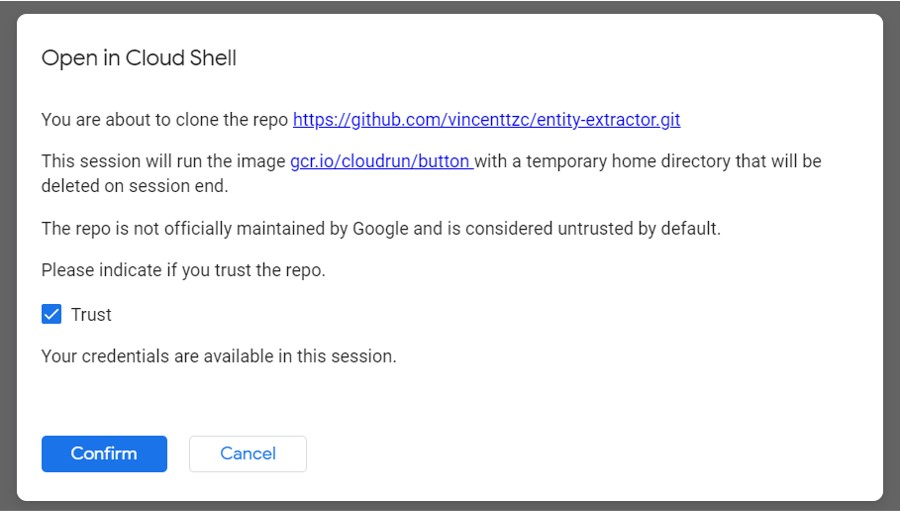
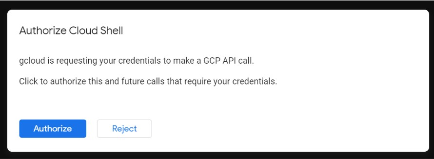

# Entity Extractor

Entity Extractor is a web API service that extracts the entities and the accompanying sentence from an URL.

Click on the Google Cloud button below to deploy this container on a GCP account via Google Cloud Run.

[](https://deploy.cloud.run)

## Usage

### Run on Google Cloud Run

1. Click on Cloud Run button above
2. Google Cloud will show a popup, asking you if you trust the repo. Tick Trust and select Confirm



3. Google Cloud will then show another popup asking if you Authorize GCP API call with ypur credentials. Click Authorize



4. Select project to deploy application
5. Select region to deploy application
6. Google Cloud Run will build the container image and push to your Project registry. The image will then be deployed.
7. Note down the web server URL provided by Google Cloud Run

### Run locally

1. Clone repo

```
git clone https://github.com/vincenttzc/entity-extractor.git
```

2. Build docker image

```
docker build -t entity-extractor .
```

3. Run docker container

```
docker run --env-file env_config/.env.dev -p 8080:8080 entity-extractor
```

## API Endpoints

When run on Cloud Run, web server URL is provided by Google Cloud Run.

When run locally, web server URL is `http://127.0.0.1:8080/`.

| Endpoint            | Request Type | Description                                                                                                               | Example request body                                   | Example response body                                                         |
| ------------------- | ------------ | ------------------------------------------------------------------------------------------------------------------------- | ------------------------------------------------------ | ----------------------------------------------------------------------------- |
| /extract_entities   | POST         | Extract the entities and sentences from URL provided then insert in database. Returns unique entities extracted from URL. | {"input_link": "https://en.wikipedia.org/wiki/Betta" } | {"entities": ["Betta", "United Nations"]}                                     |
| /query_all_entities | GET          | Query all unique entities in database                                                                                     | NA                                                     | {"entities": ["Betta", "United Nations"]}                                     |
| /query_sentences    | POST         | Query all sentences containing entity specified from database                                                             | {"entity": "Betta"}                                    | {"sentences": ["sentence 1 containing Betta", "sentence 2 containing Betta"]} |
